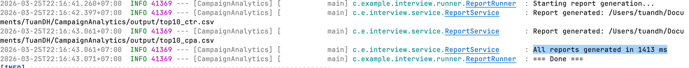

# Campaign Analytics Report Generator

A high-performance CLI application built with Spring Boot and DuckDB for analyzing large CSV campaign data and generating analytical reports.

## 📋 Prerequisites

- **Java 17+**
- **Maven 3.6+**

## 🏃‍♂️ How to Run

### Method 1: Maven Wrapper (Recommended)
```bash
# Run the application directly
./mvnw spring-boot:run
```

### Method 2: Using System Maven
```bash
# If you have Maven installed globally
mvn spring-boot:run
```

### Method 3: Build and Run JAR
```bash
# Build executable JAR file
./mvnw clean package

# Run the JAR
java -jar target/CampaignAnalytics-0.0.1-SNAPSHOT.jar
```

### Expected Output
When you run the application, you should see:
```
=== Campaign Analytics Report Generator ===
Starting report generation...
Created output directory: /path/to/CampaignAnalytics/output
Report generated: /path/to/CampaignAnalytics/output/top10_ctr.csv
Report generated: /path/to/CampaignAnalytics/output/top10_cpa.csv
All reports generated in 1336 ms
=== Done ===
```

### Output Files
After successful execution, check the `output/` directory for:
- `top10_ctr.csv` - Top 10 campaigns with highest CTR
- `top10_cpa.csv` - Top 10 campaigns with lowest CPA

## 📦 Libraries Used

### Core Dependencies
| Library | Version | Purpose |
|---------|---------|---------|
| **Spring Boot** | 3.5.12 | Application framework & dependency injection |
| **DuckDB JDBC** | 1.5.1.0 | High-performance analytical database engine |
| **SLF4J** | (via Spring Boot) | Logging framework |

## 🚀 Performance & Benchmarks

### Processing Speed
- **1GB CSV File**: ~1.3 seconds end-to-end
- **Report Generation**: Both reports generated simultaneously
- **Throughput**: ~750MB/second processing rate



### Memory Usage
- **Peak Memory**: 100-200MB during processing
- **Streaming Processing**: No need to load entire file into memory
- **Memory Efficient**: DuckDB's columnar engine minimizes RAM usage

### System Requirements
- **Minimum RAM**: 512MB available
- **Recommended RAM**: 1GB+ for optimal performance
- **Disk Space**: ~2GB (1GB input + temporary files + output)

## 🛠️ Solution Decisions

### Why DuckDB Over Traditional Database?
Initially considered using Spring Boot with Liquibase to create tables and load CSV data into a traditional database. However, this approach was **unnecessary** for this use case because:

- **No persistent storage needed**: Data is only read once for report generation
- **No CRUD operations**: No updates, inserts, or complex queries required
- **Performance bottleneck**: Loading large CSV files into traditional databases is resource-intensive

### Key Architectural Choices

**DuckDB**: Chosen as the analytical engine because it can:
- Process CSV files **directly** without loading entire datasets into memory
- Provide **columnar storage** optimization for analytical queries
- Execute complex aggregations with **minimal overhead**
- Handle **large files** (1GB+) efficiently with streaming processing

**Spring Boot**: Retained for:
- Dependency injection and clean architecture
- Easy CLI application structure


